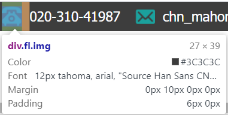

我吐了，今晚一上来就出事，首先ps的标尺莫名奇妙给关了，然后自动切图的脚本也运行不了，只好手动扣一扣了。

大概划好了上下部分，就开始了

## 难题

- 头部菜单的小图标居中

  因为是采用的a标签套img标签，结果怎样都居中不了，折腾了一两个小时，最后决定给img套上一层div，然后给div内边距，感觉是最优解了，表格布局也解不了

  

## 反思

基础方面还是不扎实，还是得深入了解更多的居中方式

希望明天效率能更高一些

